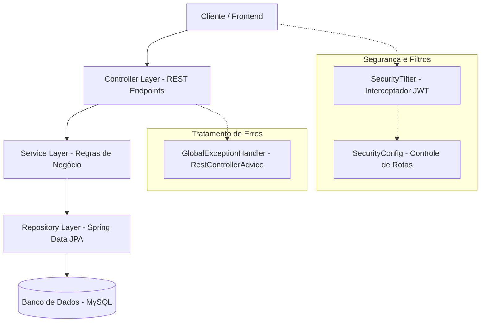

# Documentação Técnica - API Portal Aluno

Esta documentação descreve a arquitetura técnica, modelo de dados, configurações de segurança e infraestrutura da API **Portal Aluno**, construída com Spring Boot 3.5.x e Java 21.

---

## 1. Visão Geral da Arquitetura

A API segue a arquitetura multicamadas padrão do ecossistema Spring:



### Tecnologias Utilizadas:
* **Java 21**: Versão moderna do Java que habilita o uso de `record`s compactos.
* **Spring Boot 3.5.x**: Core do framework.
* **Spring Data JPA & Hibernate**: Persistência de dados com ORM.
* **Spring Security 6.x & Auth0 Java-JWT**: Segurança robusta com criptografia BCrypt e autenticação sem estado (stateless) via JWT.
* **Springdoc OpenAPI (Swagger UI)**: Geração automatizada de documentação e console interativo.
* **Lombok**: Geração em tempo de compilação de construtores, builders e acessores nas entidades JPA.
* **MySQL**: Banco de dados relacional.

---

## 2. Estrutura de Diretórios e Pacotes

```text
com.cebe.portal_aluno
├── config/                 # Configurações de Segurança e Filtros HTTP
│   ├── SecurityConfig.java # Política de CORS, CSRF, Sessões e Rotas
│   └── SecurityFilter.java # Interceptador e Validador de Tokens JWT
├── controller/             # Controladores REST expondo as Rotas da API
│   ├── AlunoController.java
│   ├── AuthController.java
│   ├── ProfessorController.java
│   └── ...
├── dto/                    # Objetos de Transferência de Dados (Records)
│   ├── request/            # Payload de Entrada (ex: AlunoRequestDTO)
│   ├── response/           # Payload de Saída (ex: AlunoResponseDTO)
│   ├── AlunoDTO.java
│   └── ...
├── entity/                 # Entidades Mapeadas para o JPA (Hibernate)
│   ├── Aluno.java          # Implementa UserDetails
│   ├── Professor.java
│   ├── enums/              # Enumerações (StatusPagamento, Turno, etc.)
│   └── ...
├── exception/              # Tratamento Centralizado de Exceções
│   ├── GlobalExceptionHandler.java # Interceptador RestControllerAdvice
│   ├── ErrorResponseDTO.java       # Estrutura JSON de Erro
│   └── ...
├── repository/             # Interfaces de Acesso ao Banco de Dados
│   ├── AlunoRepository.java
│   └── ...
└── service/                # Camada de Regras de Negócio e Serviços
    ├── AlunoService.java
    ├── TokenService.java   # Criação e decodificação do JWT
    └── ...
```

---

## 3. Modelo de Dados e Banco de Dados

A base de dados é hospedada em servidor MySQL local (`localhost:3306`) com o schema de nome `cebe`. O mapeamento ORM é controlado pelo Hibernate configurado como `spring.jpa.hibernate.ddl-auto=update`.

### Entidades Mapeadas:
1. **`Aluno`**: Entidade contendo `id`, `nome`, `telefone`, `cpf` (único), `email` (único) e `senha` (criptografada). Implementa `UserDetails` do Spring Security para atuar como o principal da sessão.
2. **`Professor`**: Entidade contendo `id`, `nome`, `email` e `especializacao`.
3. **`Cursos`**: Entidade com os cursos cadastrados contendo `id`, `nome` e `cargaHoraria`.
4. **`Turma`**: Contém chaves estrangeiras relacionando chaves de `Cursos` (`ID_CURSOS`) e `Professor` (`ID_PROFESSOR`), além do turno (`Turno`), `lotacaoMaxima` e `vagasOcupadas`.
5. **`Matricula`**: Associa `Aluno` e `Turma` para representar inscrições, guardando a data e o status do pagamento.
6. **`Atendimento`**: Registro de suporte que vincula `Aluno`, guardando mensagens, data/hora e status.

---

## 4. Camada de Segurança (JWT & Spring Security)

### Autenticação Sem Estado (Stateless):
A segurança foi estruturada para atuar sob o modelo JWT token-based.
* **`TokenService`**: Gera tokens codificados com assinatura **HMAC256** utilizando uma chave secreta (`api.security.token.secret`), configurando uma data de expiração de 2 horas.
* **`SecurityFilter`**: Filtro que intercepta requisições HTTP (`OncePerRequestFilter`), extrai o cabeçalho `Authorization: Bearer <token>`, valida-o e injeta o objeto `Aluno` autenticado no `SecurityContextHolder`.
* **Criptografia**: Toda senha fornecida no cadastro de aluno é criptografada no banco através do bean `BCryptPasswordEncoder`.

> [!TIP]
> **Modo Desenvolvimento**: O arquivo `SecurityConfig.java` foi configurado temporariamente com `.anyRequest().permitAll()` para permitir testes locais rápidos. As configurações prontas para restrição e caminhos públicos do Swagger já estão prontas dentro dos blocos comentados da classe.

---

## 5. Tratamento de Erros e Exceções

O tratamento de falhas da API foi completamente centralizado utilizando a anotação `@RestControllerAdvice`.
* **Erros Customizados**:
  - `RecursoNaoEncontradoException`: Retorna HTTP `404 Not Found`.
  - `RegraDeNegocioException`: Retorna HTTP `400 Bad Request`.
* **Erros de Validação**:
  - Intercepta `MethodArgumentNotValidException` (gerados quando campos anotados com `@NotBlank`, `@NotNull` no DTO falham) e mapeia cada campo inválido individualmente no objeto `FieldErrorDTO`.
* **Resposta Padronizada**:
  Todas as exceções retornam um JSON formatado com o `ErrorResponseDTO` contendo: `timestamp`, `status`, `error`, `message`, `path` e a lista `fields` (caso haja validações pendentes).

---

## 6. Frontend e Interface do Aluno

O frontend da aplicação foi construído com arquitetura Client-side utilizando HTML5, CSS3 moderno e JavaScript puro (vanilla), sem o uso de empacotadores (como Webpack) ou frameworks complexos (como React/Vue), garantindo leveza e carregamento instantâneo no navegador.

### Estrutura de Pastas do Frontend

O frontend é servido a partir da pasta `client/` e organizado para máxima separação de responsabilidades:

```text
client/
├── public/                 # Arquivos estáticos globais (imagens, logos institucionais)
└── src/
    ├── assets/             # Folhas de estilo (CSS). Variáveis no style.css e módulos por tela (financeiro.css).
    ├── components/         # Scripts globais (nav.js injeta dinamicamente Menu, Topbar e Bottom Navigation).
    ├── pages/              # Interface de visualização (HTML), como login.html, dashboard.html.
    └── services/           # Integração HTTP com o Spring Boot. O arquivo api.js gerencia a função apiFetch() que anexa o JWT.
```

### Gerenciamento de Sessão e Estado
Toda a persistência local de sessão e notificações baseia-se no **`localStorage`** do navegador:
1. **Sessão JWT**: O token retornado após o sucesso do `POST /auth/login` é armazenado na chave `cebe_token`. O Logout simplesmente destrói essa chave e devolve o aluno para a tela de login.
2. **Notificações Locais**: As mensagens do sino de notificações (Avisos Gerais) são guardadas de forma assíncrona e local utilizando scripts e emissões de eventos (`CustomEvent`) diretamente em Vanilla JS, atualizando o contador de alertas em tempo real.

---
